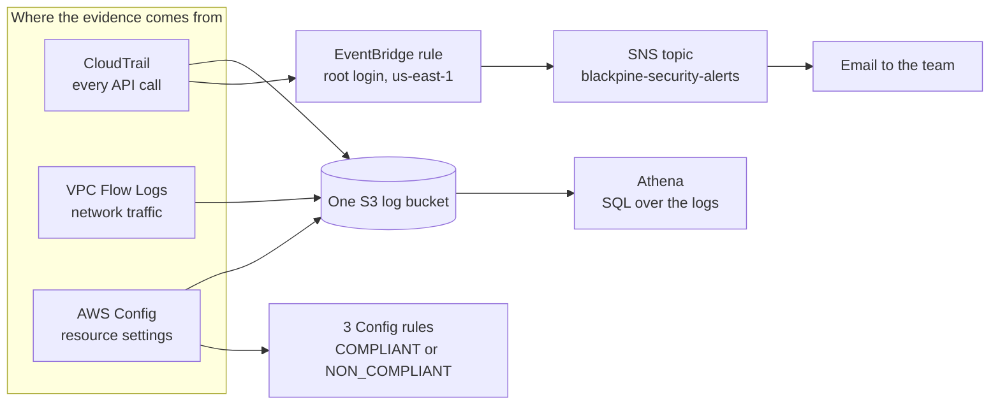
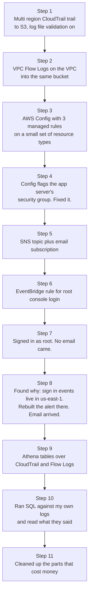

# AWS Detection, Logging and Monitoring

A hands-on build of logging, compliance checks, alerting and log searching for a small SaaS company on AWS. Everything here was built in a real AWS account in `eu-north-1`, tested with real events, and checked with real output. When something did not work the first time, I kept the story of how I found and fixed it.

## What is Blackpine?

Blackpine is a made up company I use to give this project a real shape.

Blackpine sells a simple online invoicing tool to freelancers and small businesses. Customers log in, create invoices and send them to their clients. The whole product runs on one small web server in AWS, and the team is five people with no security person.

That small setup raises one simple question, and this project is my answer to it:

> If something bad happened in Blackpine's AWS account tonight, would anyone know, and could anyone work out what happened?

To answer that, Blackpine needs four things:

| Question | AWS service that answers it |
|---|---|
| Who did what, and when? | CloudTrail |
| Who talked to whom over the network? | VPC Flow Logs |
| Is each resource set up the way it should be? | AWS Config |
| Will a human get told when something important happens? | EventBridge and SNS |

And one more thing on top: a way to search all of those logs with plain SQL when you need answers, which is Athena.

## The environment

Blackpine's app server is deliberately simple, and set up the safe way from day one:

* One `t3.micro` EC2 instance (`blackpine-app-server`) running Amazon Linux 2023
* A security group (`blackpine-app-sg`) meant to have **no inbound rules at all**
* Access to the server only through SSM Session Manager, so there is no SSH and no open port 22
* An IAM role (`BlackpineAppServerRole`) that can only write to its own log group (`/blackpine/app-server`), plus the AWS managed policy SSM needs

That "no inbound rules" part becomes important later.

## How it all fits together



The simple way to remember it: CloudTrail and Flow Logs are the raw evidence. Config gives an opinion about that evidence (is this setting allowed or not). EventBridge and SNS make sure a person actually hears about the important stuff. Athena lets you ask questions of everything later.

## The build, step by step



Each part has its own write up with more detail:

| Write up | What it covers |
|---|---|
| [Logging foundation](docs/logging-foundation.md) | CloudTrail, Flow Logs and Config, and the security group Config caught |
| [Root login alert](docs/root-login-alert.md) | SNS and EventBridge, why the first alert never arrived, and how I proved it |
| [Querying the logs](docs/querying-logs.md) | Athena tables, three SQL questions, and what the answers told me |
| [Costs and cleanup](docs/costs-and-cleanup.md) | Where the money goes in this kind of setup, and what I switched off |

## Findings worth keeping

**Config caught a real mistake in my own setup.** The app server was designed to have no inbound rules. The `restricted-ssh` rule still marked its security group `NON_COMPLIANT` because port 22 was open to `0.0.0.0/0`. I removed the rule, asked Config to check again, and it came back `COMPLIANT`. A written design and the real setup had drifted apart, and only the automatic check noticed.

**The first alert failed silently.** I built the root login alert in `eu-north-1`, signed in as root, and got nothing. No error anywhere. I sent a test message straight to SNS, skipping EventBridge, and that email arrived. So SNS and its permissions were fine, and the problem had to be before SNS. The reason: console sign in events are global events, and AWS delivers them to EventBridge in `us-east-1` only. I rebuilt the topic and rule in `us-east-1`, signed in as root again, and the email arrived with `"awsRegion":"global"` inside it.

**The busiest identities in the account were machines.** When I asked Athena which identity made the most API calls, the top of the list was AWS Config's own role scanning resources, then the app server's role. My own admin role came after them, spread across at least four different IP addresses. That is normal for a home internet connection whose address changes, and it is also exactly the kind of thing you would check first in a real incident.

**Athena did not like my table statements from the CLI.** Two `CREATE TABLE` statements failed through `aws athena start-query-execution` with `MALFORMED_QUERY`. The same kind of statement worked from the Athena console. I did not find the root cause, so I noted it and used the console for table creation.

## What this project does not cover yet

The next layer for Blackpine is managed threat detection: GuardDuty for spotting attacks, and Security Hub CSPM for scoring the account against the CIS AWS Foundations Benchmark. When I tried to turn them on, the account returned a `SubscriptionRequiredException`. Both services also carry an ongoing monthly cost. For a five person company at Blackpine's stage, getting logging, compliance checks and alerting solid first is the sensible order, so I left these two for the next step.

When they are added, the alert pipeline built here already has a place for them. A second EventBridge rule would send only high severity GuardDuty findings (7 and above) to the same SNS topic, so the team only gets woken up for things that matter:

```json
{
  "source": ["aws.guardduty"],
  "detail-type": ["GuardDuty Finding"],
  "detail": {
    "severity": [{ "numeric": [">=", 7] }]
  }
}
```

## What is in this repo

| Path | What it holds |
|---|---|
| `docs/` | One write up per part of the build |
| `athena/` | The table statements and the SQL queries I ran |
| `event-patterns/` | The EventBridge pattern for the root login alert |
| `policies/` | The S3 log bucket policy, the SNS topic policy and the app server role policy |
| `evidence/` | Screenshots of real output from the account |

## Running any of this yourself

The account ID, bucket names and ARNs in the policies and queries are from my account. Swap them for your own. The one thing to remember from this build: if you want alerts on sign in events, build the EventBridge rule and the SNS topic in `us-east-1`, whatever region you normally work in.
