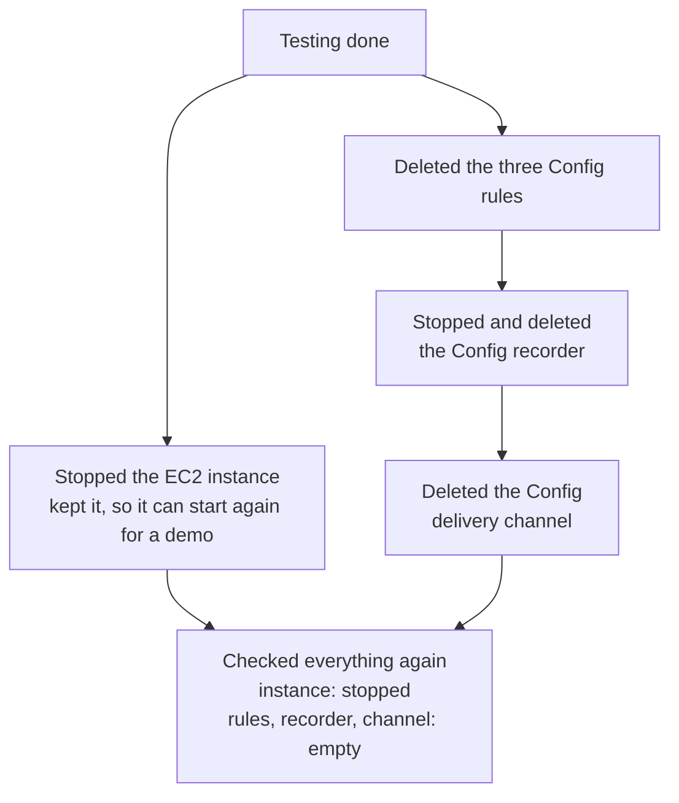

# Costs and cleanup

Detection has a running cost, and on a small account it is easy to get surprised. I set up a billing alert before building anything, so any real charge would send me an email.

## Where the money goes

| Service | What you pay for | How I kept it small |
|---|---|---|
| CloudTrail | The first copy of management events is free. Data events are charged per event. | Data events on one small test bucket only |
| VPC Flow Logs | The volume of log data delivered | One VPC, one quiet server |
| AWS Config | Every configuration change recorded, and every rule check | Only three resource types, only three rules |
| Athena | The amount of data each query scans | Small logs. My busiest query scanned about 1.6 MB |
| EventBridge | Nothing extra for AWS events on the default bus | One rule |
| SNS | Email delivery has a free monthly allowance | A handful of test emails |
| EC2 | The instance for every hour it runs | `t3.micro`, stopped when not in use |

The three that can really grow at scale are CloudTrail data events, Config recording, and Athena scans. For Athena the usual answer is partitioning the tables by date, so a query about one day only reads one day of files.

## What I switched off after testing

The rules had to go first, because they depend on the recorder. After that, a fresh `describe` call for each one came back empty, and the instance state came back as `stopped`.

What I kept running, because it costs close to nothing and it is the evidence behind this repo:

* The CloudTrail trail and the log bucket
* The VPC Flow Log
* The SNS topic and the EventBridge root login rule in `us-east-1`
* Both Athena tables and the results bucket

A stopped instance still keeps its EBS disk, and that disk has a small monthly storage cost. That is fine for now.
