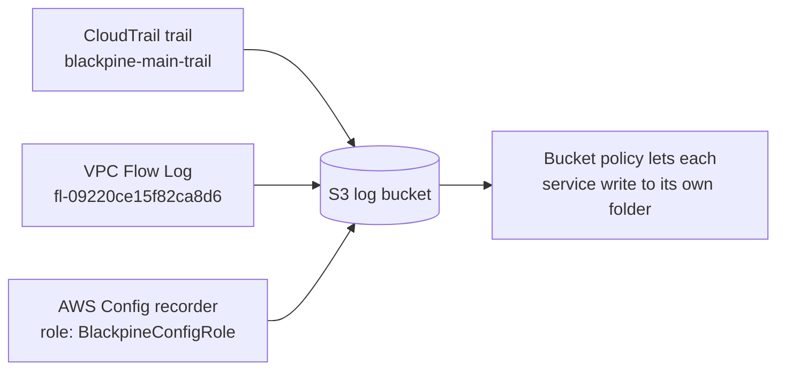
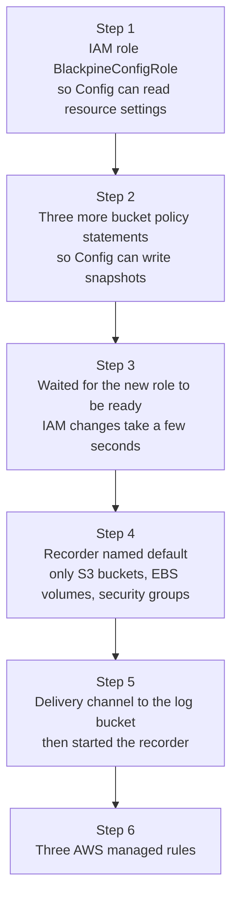
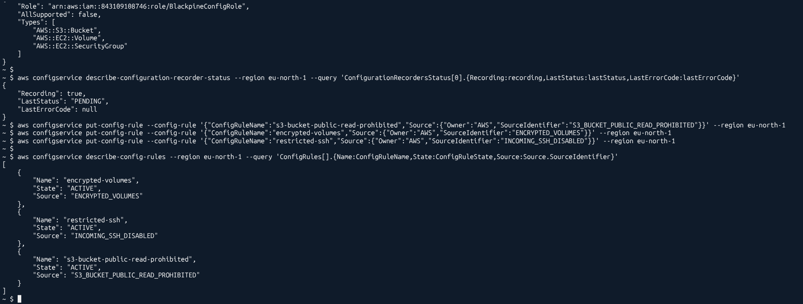
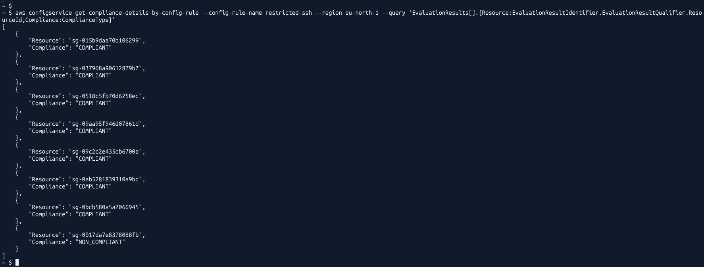
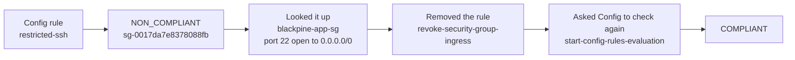
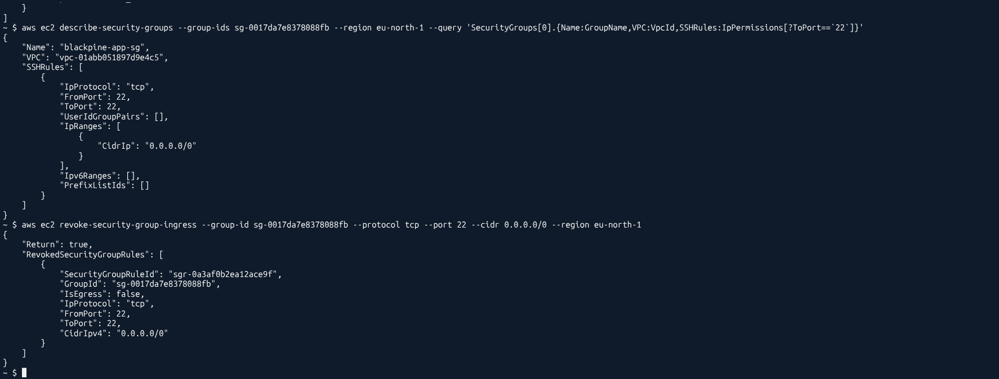
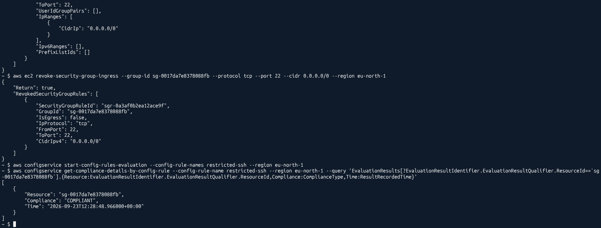

# Logging foundation

Before Blackpine can detect anything, it needs evidence. This part sets up the three sources of evidence and sends all of them into one S3 bucket: `aws-cloudtrail-logs-843109108746-c279e358`.

## CloudTrail: who did what, and when

CloudTrail records API calls: who made the call, what the call was, the source IP, the time and the result. Almost every investigation starts here.

What I set up:

* A trail called `blackpine-main-trail`, recording in all regions
* Log file validation on, so AWS writes digest files that prove the logs were not changed afterwards
* Management events on (things like `CreateBucket`, `AssumeRole`, `RunInstances`)
* Data events on for **one** small test bucket only, `blackpine-data-events-test-843109108746`

Why only one bucket for data events? Data events are object level calls like `GetObject` and `PutObject`. A busy bucket can make more of those in an hour than the whole account makes management events in a month, and each one costs money. They are off by default for that reason. The catch is that if someone empties a bucket that has no data events turned on, CloudTrail will show you nothing about it. I wanted to see that difference with my own eyes on a test bucket, without paying for it everywhere.

**Gotcha I hit:** my first data event selector had the wrong ARN prefix in its `StartsWith` condition. The trail looked perfectly fine in the console, and still no data events showed up. Once the prefix matched the real bucket ARN, the object level events started appearing in the logs.

## VPC Flow Logs: who talked to whom

Flow Logs record metadata about network traffic in the VPC: source and destination IP, ports, protocol, bytes, packets, time, and whether the traffic was `ACCEPT`ed or `REJECT`ed. They never show the content of the traffic.

What I set up:

* A flow log on the VPC the app server lives in, capturing all traffic (`ACCEPT` and `REJECT`)
* Delivery straight to the same S3 bucket, under `AWSLogs/843109108746/vpcflowlogs/`

To make that work, the bucket policy needed two new statements for the log delivery service (`delivery.logs.amazonaws.com`): one to check the bucket ACL, one to write objects. Both are locked to my account and to log sources in `eu-north-1`. The full policy is in [`policies/log-bucket-policy.json`](../policies/log-bucket-policy.json).

The flow log came up `ACTIVE`, and a little later the first `.log.gz` files showed up in the bucket. Worth knowing: with S3 as the destination, ten minutes is the shortest aggregation window you can pick. Only CloudWatch Logs as a destination gives you one minute.

## AWS Config: is each resource set up the way it should be?

CloudTrail tells you **who** changed something. Config tells you **what a resource looks like** now and before, and whether that state breaks a rule. I use CloudTrail to tie an action to a person, and Config to prove a resource was misconfigured during a certain time.

What I set up:

Config needs **two** separate permissions, which is different from CloudTrail and Flow Logs. It needs an IAM role to read the settings of resources (all the `Describe` and `List` calls), and it needs the bucket policy to let it write snapshots. Miss either one and it fails.

I kept the recorder to three resource types on purpose. Config charges for every configuration change it records and for every rule check, so "record everything" is the easiest way to get a surprise bill in this whole setup.

The three managed rules:

| Rule | What it checks |
|---|---|
| `s3-bucket-public-read-prohibited` | No bucket allows public read access |
| `encrypted-volumes` | Attached EBS volumes are encrypted |
| `restricted-ssh` | No security group allows port 22 from anywhere |

## The finding: Config caught my own mistake

Blackpine's app server was designed to have **no inbound rules at all**. You reach it through SSM Session Manager only. So I expected `restricted-ssh` to pass everything.

It did not. Seven security groups were `COMPLIANT`, and one was `NON_COMPLIANT`:

That one was `sg-0017da7e8378088fb`, which is `blackpine-app-sg`, the app server's own security group. It had port 22 open to `0.0.0.0/0`, the whole internet.

What I take from this: the design said "no SSH", and the real account said otherwise. Nobody would have looked at that security group by hand, because everyone "knew" it was closed. The automatic rule looked anyway.
