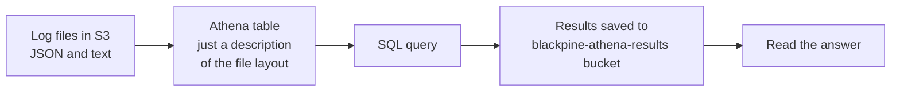
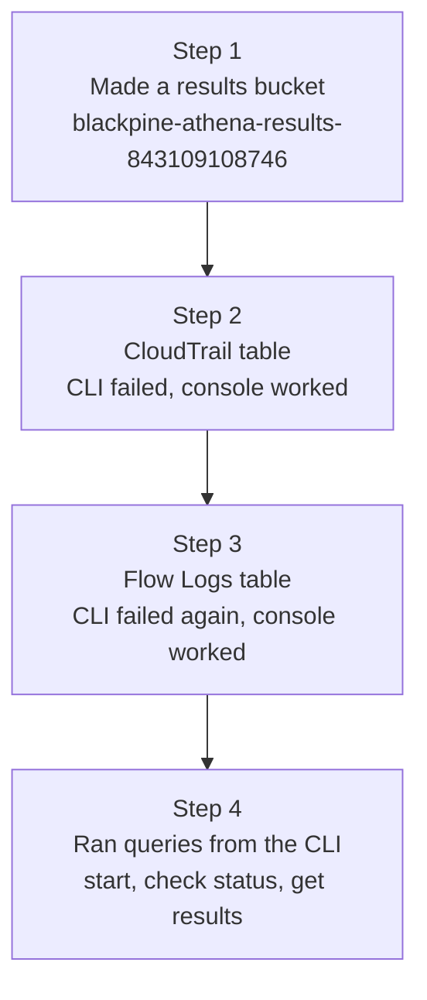
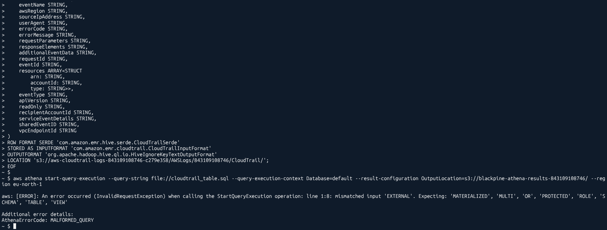
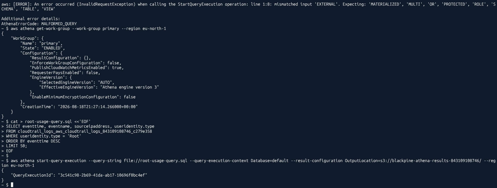

# Querying the logs

Blackpine now has logs piling up in S3. That is only useful if you can ask them questions. Athena lets you run normal SQL on files sitting in S3, without moving or loading anything.

## How Athena works here



A table in Athena does not copy any data. It is only a description of what the files look like, so Athena knows how to read them. Queries are billed by how much data they scan.

## Creating the tables



Two tables:

* **CloudTrail** ([`athena/01-cloudtrail-table.sql`](../athena/01-cloudtrail-table.sql)). CloudTrail logs are nested JSON, so the table uses nested `STRUCT` columns. That is why you can write `useridentity.type` in a query.
* **VPC Flow Logs** ([`athena/02-vpc-flow-logs-table.sql`](../athena/02-vpc-flow-logs-table.sql)). Flow logs are plain lines of text split by spaces, so this one is a flat table.

**Gotcha I did not fully solve:** sending the `CREATE EXTERNAL TABLE` statement through `aws athena start-query-execution` failed with `MALFORMED_QUERY`. The workgroup runs Athena engine version 3. A second attempt for the Flow Logs table, written in a different style, failed with a different parse error.



Yet the same kind of statement worked when run from the console: the CloudTrail one through the "Create Athena table" button on the trail page, and the Flow Logs one in the Athena query editor. I did not pin down why the CLI path refused them, so I used the console for creating tables and the CLI for everything else. Running queries from the CLI worked every time.

Running a query from the CLI takes three calls, because Athena works in the background:

```bash
# 1. start it, get back an ID
aws athena start-query-execution \
  --query-string file://03-root-activity.sql \
  --query-execution-context Database=default \
  --result-configuration OutputLocation=s3://blackpine-athena-results-843109108746/ \
  --region eu-north-1

# 2. check if it finished
aws athena get-query-execution --query-execution-id <ID> --region eu-north-1

# 3. read the rows
aws athena get-query-results --query-execution-id <ID> --region eu-north-1
```



## Question 1: who used the root account, and from where?

Query: [`athena/03-root-activity.sql`](../athena/03-root-activity.sql)

```sql
SELECT eventtime, eventname, sourceipaddress, useridentity.type
FROM cloudtrail_logs_aws_cloudtrail_logs_843109108746_c279e358
WHERE useridentity.type = 'Root'
ORDER BY eventtime DESC
LIMIT 50;
```

What came back (IPs shortened):

| eventtime (UTC) | eventname | sourceipaddress |
|---|---|---|
| 2026-09-23T16:49:29Z | ListAccountActivities | IPv6 address |
| 2026-09-23T16:49:21Z | ListNotificationHubs | 78.241.x.x |
| 2026-09-23T16:49:18Z | GetCostAndUsage | 78.241.x.x |
| 2026-09-23T16:49:18Z | GetCostForecast | 78.241.x.x |
| 2026-09-23T16:49:10Z | **ConsoleLogin** | 78.241.x.x |
| 2026-09-23T16:27:46Z | ListNotificationHubs | 78.241.x.x |
| 2026-09-23T16:27:44Z | GetCostAndUsage | 78.241.x.x |
| ... | ... | ... |

What it told me:

* There were **two** root sessions. The one at 16:27 is my first test, the one where no email came. The one at 16:49 is the second test, and its `ConsoleLogin` time matches the alert email exactly. So the logs tell the same story as the alert debugging.
* One root login creates a lot of rows. Most of them are the console loading its home page (billing widgets, notifications, region lists). In a real incident you would look past this noise for calls that change things, like `Create`, `Put`, `Attach` or `Delete`.
* The same session shows both an IPv4 and an IPv6 address. That is just a home connection that has both. Worth knowing before you panic about "two different IPs".

## Question 2: which addresses moved the most data?

Query: [`athena/04-top-talkers.sql`](../athena/04-top-talkers.sql)

```sql
SELECT srcaddr, dstaddr, SUM(bytes) AS total_bytes
FROM vpc_flow_logs
WHERE action = 'ACCEPT'
GROUP BY srcaddr, dstaddr
ORDER BY total_bytes DESC
LIMIT 20;
```

What it told me: the traffic at the top was the app server talking to AWS, which matches the SSM agent checking in so Session Manager works. That is the expected, boring answer for a server that has no inbound rules and no users yet. On a real system this is the query that would show a server suddenly sending a lot of data to an address nobody recognises. Flow Logs cannot show what was sent, but the volume and the destination are often enough to raise the alarm.

## Question 3: which identity made the most API calls in the last 24 hours, and from which IPs?

Query: [`athena/05-busiest-identities-24h.sql`](../athena/05-busiest-identities-24h.sql)

```sql
SELECT useridentity.arn AS arn,
       sourceipaddress,
       COUNT(*) AS call_count
FROM cloudtrail_logs_aws_cloudtrail_logs_843109108746_c279e358
WHERE from_iso8601_timestamp(eventtime) > current_timestamp - INTERVAL '24' HOUR
GROUP BY useridentity.arn, sourceipaddress
ORDER BY call_count DESC
LIMIT 20;
```

What came back (top rows, my home IPs shortened):

| Identity | Source | Calls |
|---|---|---|
| `BlackpineConfigRole/ConfigResourceCompositionSession` | config.amazonaws.com | 877 |
| `BlackpineAppServerRole/i-038d6601f6f24387a` | 16.170.162.14 | 481 |
| (no ARN) | cloudtrail.amazonaws.com | 396 |
| (no ARN) | config.amazonaws.com | 346 |
| `BlackpineConfigRole/AWSConfig-Describe` | config.amazonaws.com | 309 |
| `NorthbeamAdmin/Ishaan-admin` | 87.89.x.x | 248 |
| `AWSServiceRoleForResourceExplorer/resource-explorer-2` | resource-explorer-2.amazonaws.com | 236 |
| `NorthbeamAdmin/Ishaan-admin` | 78.241.x.x | 160 |
| `NorthbeamAdmin/Ishaan-admin` | 78.241.x.x | 108 |
| `NorthbeamAdmin/Ishaan-admin` | 78.241.x.x | 33 |

The query took about 2 seconds and scanned about 1.6 MB of logs.

What it told me:

* **The busiest identity was a machine.** AWS Config's role made the most calls by far, because it keeps reading the settings of every resource it records. The Config rows add up to well over a thousand calls in a day. That is also a good picture of why Config costs money.
* **When the source is a name like `config.amazonaws.com` instead of an IP**, an AWS service made the call for you. A real IP means the call came from a network location, like a server or a laptop.
* **The app server's role called AWS from the server's own public IP.** That is the SSM agent on the server doing its normal work. If those same role credentials ever showed up from a different IP, that would be a serious warning sign: someone copied the credentials off the server.
* **My own admin role showed up from four different IPs.** As far as I can tell, all of them were my own connections over the day. In an incident, this is the first thing to check: is every IP for a human identity one you can explain?
