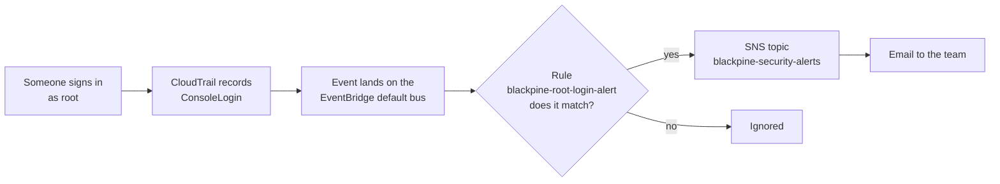
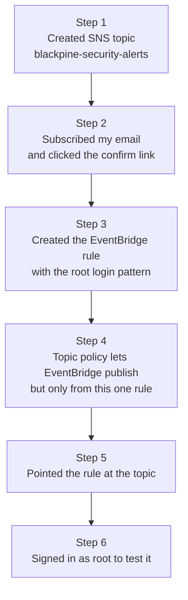
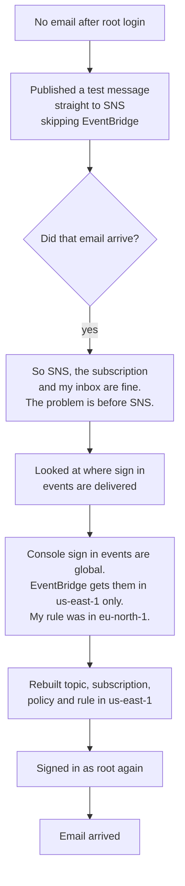
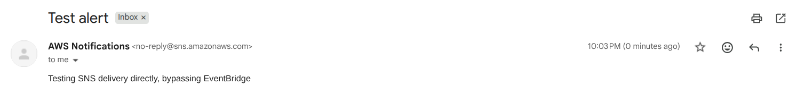
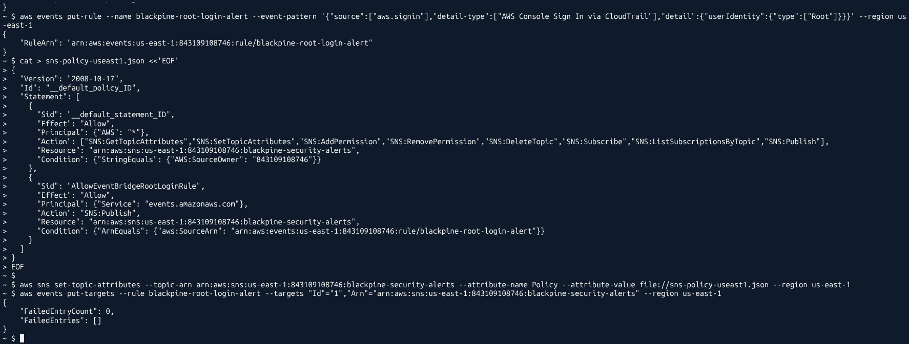
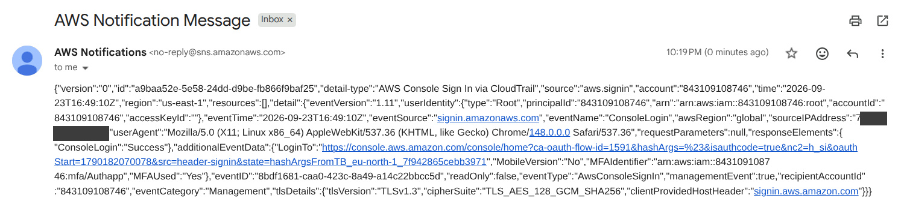

# Root login alert

Logs only help if someone reads them. Nobody at Blackpine is going to sit and watch a console all day, so the important events need to reach a person on their own.

The event I picked is a sign in with the **root account**. Root can do anything in the account, it should almost never be used, and a root login you did not expect is one of the clearest signs that something is wrong.

## How the alert works



The EventBridge rule matches on this pattern (also in [`event-patterns/root-console-login.json`](../event-patterns/root-console-login.json)):

```json
{
  "source": ["aws.signin"],
  "detail-type": ["AWS Console Sign In via CloudTrail"],
  "detail": {
    "userIdentity": {
      "type": ["Root"]
    }
  }
}
```

You read it like a filter. Every field you write down has to match. Anything you leave out matches anything.

## Building it



Step 4 matters. By default an SNS topic does not let other AWS services publish to it. I added one statement that allows `events.amazonaws.com` to publish, with a condition that the request must come from the ARN of this exact rule. Any other rule in the account still cannot use the topic. The full policy is in [`policies/sns-topic-policy.json`](../policies/sns-topic-policy.json).

One small CLI gotcha along the way: `aws sns subscribe --endpoint ...` does not work, because `--endpoint` gets read as the global `--endpoint-url` flag. The SNS option is called `--notification-endpoint` for exactly that reason.

## The first test failed

I signed in as root. No email came. No error showed up anywhere either, which is the worst kind of failure for an alert, because it looks the same as "nothing happened".

Instead of changing things at random, I split the pipeline in half and tested one half on its own:



The direct test message arrived:



That one test cut the search in half. Everything from SNS onwards worked, so the fault had to be in how the event reached the rule.

The answer: sign in events come from global services (the same goes for IAM and STS). AWS sends them to EventBridge in `us-east-1`, whatever region you are looking at in the console. My rule sat in `eu-north-1`, where those events never arrive, so it never had anything to match.

## The fix

I rebuilt the whole alert in `us-east-1`: a new topic with the same name, a new email subscription, the topic policy with `us-east-1` ARNs, and the rule itself.



Then I signed in as root again, and this time the email came through. The event inside it shows `"region":"us-east-1"` and `"awsRegion":"global"`, which confirms the whole explanation. It also shows `"MFAUsed":"Yes"`, which is what you want to see on a root login. (My home IP is blacked out.)



The old rule and topic in `eu-north-1` are still there as a reminder, and they will never fire.

## What I would do if this email arrived for real

If this alert showed up and nobody on the team had signed in as root, the first things to check would be:

1. Look in CloudTrail for every event from the root identity after that sign in, to see what the session actually did
2. Check the source IP and user agent against where the team normally works from
3. Check whether MFA was used (in this email it was)
4. If anything looks wrong: change the root password, check the root MFA device, look for new IAM users, access keys or roles that were created, and review billing for new resources

The first check is exactly what the root activity query in [Querying the logs](querying-logs.md) does.
